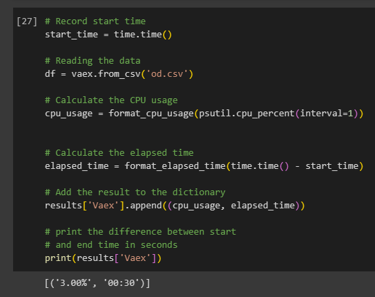
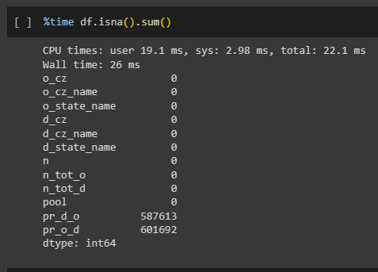

Comparison of Dask Modin and Vaex

## Group Members

|    Name           |           Matric Number       |                      
|-------------------|-------------------------------|
|Mikhail Bin Yassin |A21EC0053                      |
|Muhammad Fikri Bin Sharunazim    | A21EC0075       |
|Muhammad Farhan Bin Ibrahim|        A21EC0072      |
|Muhammad Adam Fahmi Bin Mohd Taufiq |A21EC0061|


---
#About Dataset
**Young Adult Migration Pattern Dataset**

How far do people migrate between childhood and young adulthood? Where do they go? How much does one's location during childhood determine the labor markets that one is exposed to in young adulthood?

This project sheds light on these questions using newly constructed and publicly available statistics on the migration patterns of young adults in the United States. Use this resource to discover where people in your hometown moved as young adults.

Researchers at Harvard University and the Census Bureau have linked federal tax filings, Census records, and other government data to track the migration patterns of young US residents. Specifically, for each person born in the US between 1984 and 1992, the researchers compared where they lived at age 16 to where they lived at age 26. The project’s public dataset counts the approximate number who moved to/from each pair of commuting zones — overall and disaggregated by race/ethnicity and parental income level.

-------------------------------------------------------------------------

## Migration Patterns Data Dictionary

### Data Files:

• od_pooled.csv – Dataset contains count and fractions of people who move between each
origin and destination (OD) commuting zone pair. These data are unique at the OD level. The variable pool takes the value “pooled”.

• od_race.csv – Dataset contains count and fractions of people who move between each OD commuting zone pair separately by race/ethnicity. These data are unique at the OD x race level. The variable pool takes the values “Asian”, “Black”, “Hispanic”, “White”, and “Other”. Note that “Other” includes not only other races but also people who are not linked to the Decennial Census or ACS.

• od_inc.csv – Dataset contains count and fractions of people who move between each origin and destination commuting zone pair separately by parental income quintile. These data are unique at the OD x income quintile level. The variable pool takes the values “Q1” (poorest parental income quintile), …, “Q5” (richest parental income quintile).

• od.csv – Dataset contains count and fractions of people who move between each origin and destination commuting zone pair separately by race/ethnicity and parental income quintile. These data are unique at the OD x race/ethnicity x parental income level. The variable pool takes the values of the pairwise combinations of race (“Asian”, “Black”,
“Hispanic”, “White”, and “Other”) and parental income quintile (“Q1” - “Q5”). Note that the “Other” race/ethnicity category includes not only other races but also people who are not linked to the Decennial Census or ACS.


### Geographic variables:

• `o_cz`: The numeric identifier of the commuting zone (CZ) in which the individual resided in childhood/at age 16 (referred to as origin CZ hereafter).

• `o_cz_name`: The name of the origin CZ.

• `o_state_name`: The name of the state the origin CZ is in.

• `d_cz`: The numeric identifier of the CZ in which the individual resides in young adulthood/at age 26 (referred to as destination CZ hereafter).

• `d_cz_name`: The name of the destination CZ.

• `d_state_name`: The name of the state the destination CZ is in.


### Migration variables:

• `n`: The number of individuals from origin o living in destination d.

• `n_tot_o`: Total number of individuals from origin o. Generated by summing n across d_cz cells for each o_cz.

• `n_tot_d`: Total number of individuals who live in destination d. Generated by summing n across o_cz for each d_cz.

• `pr_d_o`: Pr{D|O}. The probability an individual lives in destination d given they grew up in origin o. Generated as n/n_tot_o.

• `pr_o_d`: Pr{O|D}. The probability an individual is from origin o given they live in destination d. Generated as n/n_tot_d.


## Note:

### Functions used to calculate the Computational Metrics

We will be using time(), psutil.cpu_percent() and memory_usage() as the main function to calculate the computional metrics in this task.

- `time()`: The `time()` function in Python is used to measure the execution time of a piece of code. We will use this function to measure the time taken to execute a specific block of code.

- `psutil.cpu_percent()`: The `cpu_percent()` function in the `psutil` library is used to monitor CPU usage in Python. It returns the current system-wide CPU utilization in the form of a percentage. It requires a time interval as a parameter (e.g. seconds). We have include a time interval because CPU use is calculated over a period of time.

- `memory_usage()`: The `memory_usage(`) function in pandas is used to calculate the memory usage of a dataframe. It returns the memory usage of each column in the dataframe, as well as the total memory usage of the dataframe. By default, it only considers the memory usage of the data itself, not the memory usage of the index or other metadata. However, you can include the memory usage of the index and metadata by setting the deep parameter to True.

### `memory_usage()` VS `info()`

The `memory_usage()` method and the `.info()` method in pandas can be used to check the memory usage of a dataframe, but they provide different levels of detail.

The `memory_usage()` method returns the memory usage of each column in the dataframe, as well as the total memory usage of the dataframe. By default, it only considers the memory usage of the data itself, not the memory usage of the index or other metadata. However, you can include the memory usage of the index and metadata by setting the deep parameter to True.

On the other hand, the `info()` method provides more detailed information about the dataframe, including the number of rows and columns, the data types of each column, and the memory usage of the dataframe. It also includes information about the index, such as the number of non-null values and the memory usage.

The difference between the memory usage reported by `memory_usage()` and `info()` is that `memory_usage()` only reports the memory usage of the data itself, while `info()` reports the memory usage of the data as well as the index and other metadata. Therefore, the memory usage reported by `info()` is generally higher than the memory usage reported by `memory_usage()`.

> p.s. Some of the libraries does not support the above functions but others do. The following will be discussed further later on in this file.

## Setup:

Here we use the following dictionary to store the result of the metrics.


```python
# Initialize a dictionary to store the results
results = {'Tradisional Way':[], 'Dask': [], 'Modin': [], 'Vaex': []}
```

We then use the following function to convert it to a more human-readable format:


```python
def format_memory_usage(num, suffix='B'):
    for unit in ['', 'K', 'M', 'G', 'T', 'P', 'E', 'Z']:
        if abs(num) < 1024.0:
            return f"{num:.1f} {unit}{suffix}"
        num /= 1024.0
    return f"{num:.1f} Yi{suffix}"
```


```python
def format_elapsed_time(elapsed_time):
    minutes, seconds = divmod(elapsed_time, 60)
    return f'{int(minutes):02d}:{int(seconds):02d}'
```


```python
def format_cpu_usage(cpu_usage):
    return f'{cpu_usage:.2f}%'
```

## Setting up the Packages and modules needed.

### Dask

To use Dask, you need to install the `dask` package.

For Dask’s higher-level Pandas-like functionality, you’ll also need the `dask[dataframe]` package.

Since we use the Anaconda distribution, Dask will be installed by default. So for this example, we only need to import dask since we are using `conda` (see `dask.ipnyb`).


### Modin

To use Modin, install the `modin` package.

If you choose Ray as the backend, you’ll also need the `ray` package. We will not use this for this project.


`!pip install modin[all]`

Importing Modin is straightforward: replace `import pandas as pd` with `import modin.pandas as pd`


### Vaex

Install the `vaex` package to use Vaex.


`pip install vaex`

`import vaex`

Vaex covers some of the Pandas API but emphasizes exploration and visualization. So for this project, there are some things in pandas that vaex does not support, we will cover this later in this file.

# Reading the File

## Pandas Only


## Dask


## Modin


## Vaex



## Comparison table `For Reading the File`

| Library | CPU Usage (%) | Time Taken (seconds) | Memory Usage (GB) |
|-|-|--|--|
|Pandas Only  | 26.00%   |  29     | 4.9  |
|Dask  | 100.00%   |  1      | N/A  |
|Modin     |     5.00%       |    55            |    4.9     |
|Vaex |        3.00%      |     30       |     N/A    |


**Pandas Only:**
Description: Its memory usage can be high. The CPU usage is moderate, and the time taken is relatively longer due to loading the complete dataset. This approach is suitable for smaller datasets that comfortably fit in memory.


**Dask:**
Description: Unlike Pandas, Dask operates on chunks, thats why memory usage is **Not Applicable** making direct memory comparison challenging. Its strength lies in handling large datasets that don’t fit entirely in memory. The trade-off is higher CPU usage during parallel execution.


**Modin:**
Description: The CPU usage is low, but the time taken is longer due to the underlying backend.


**Vaex:**
Description: CPU usage is minimal, and memory optimization is a key feature. Unlike Dask, Vaex does not have memory usage evaluation since it uses `lazy evaluation` tactics.


# Overview of the Dataset


## Pandas Only


## Dask


## Modin


## Vaex


## Comparison table `Overview of the Dataset`

| Library | CPU times (user)| CPU times (system) | CPU times (total) |Wall time |
|-|-|-|-|-|
|Pandas Only  | 10 microsecond   |  1 microsecond      | 11 microsecond  |19.3 microsecond|
|Dask     |     24.9 seconds       |    3.92 seconds            |    28.9 seconds     | 20.4 seconds|
|Modin |        4 microsecond     |    1 microsecond       |     5 microsecond    |10.3 microsecond|
|Vaex |        4 microsecond     |     0.003 nanosecond       |     5 microsecond    | 8.83 microsecond

**Pandas Only:**

- CPU Times: Extremely fast, with user and system times in the microsecond range.
- Wall Time: Overall execution time is reasonable at 19.3 microseconds.

**Dask:**
- CPU Times: Significantly longer, with user and system times totaling 28.9 seconds.
- Wall Time: Takes 20.4 seconds due to parallel processing and chunk-based computation.

**Modin:**
- CPU Times: Very efficient, with user and system times totaling 5 microseconds.
- Wall Time: Takes 10.3 microseconds, making it a quick option.

**Vaex:**
- CPU Times: Minimal, with user and nanosecond-level system times.
- Wall Time: Only 8.83 microseconds, emphasizing its memory efficiency.


# Big Data Operations

## Check for missing values

### Pandas Only


### Dask


### Modin



### Vaex

Vaex does not have `isna()` method since it uses lazy evaluation. Therefore we will right away drop the columns.

### Comparison table `Checking for Missing Values`

| Library | CPU times (user)| CPU times (system) | CPU times (total) |Wall time |
|-|-|-|-|-|
|Pandas Only  | 9.91 seconds   |  53.6 millisecond      | 19.96 seconds  | 9.95 seconds|
|Dask     |     35.9 seconds       |    2.19 seconds            |    38.1 seconds     | 20.4 seconds|
|Modin |        19.1 millisecond     |    2.98 millisecond       |    22.1 millisecond   |10.3 millisecond|
|Vaex |        N/A     |     N/A      |     N/A    | N/A

**Pandas Only:**

- CPU Times: Pandas takes 19.96 seconds in total, with user time dominating.
- Wall Time: The overall execution time is 9.95 seconds.
- Description: Pandas performs well but can be slower for large datasets due to its single-threaded nature.

**Dask:**
- CPU Times:  Dask takes 38.1 seconds, with significant user and system times.
- Wall Time: The total execution time is 20.4 seconds.
- Description: Dask’s parallel processing capabilities lead to longer CPU times but allow handling larger datasets efficiently.

**Modin:**
- CPU Times: Modin is lightning-fast, taking only 22.1 milliseconds.
- Wall Time: The overall time is 10.3 milliseconds.
- Description: Modin, as a Pandas replacement, offers impressive performance improvements. It’s ideal for quick missing value checks.

**Vaex:**
- Not applicable (N/A) since Vaex uses lazy evaluation.


## Dropping Columns

### Pandas Only


### Dask


### Modin


### Vaex


Vaex dropping columns so fast (in microseconds)

### Comparison Table for `Dropping Columns`

|Library | Time Taken (seconds) |
|-|-|
|Pandas Only| 4.16 |
|Dask| 0.02|
|Modin| 0.01|
|Vaex| 0.00|

**Pandas Only:**

- Total Time Taken: Approximately 4.16 seconds to perform the task.
- Description: When using Pandas alone, the histogram generation process was relatively quick.

**Dask:**
- Total Time Taken: Approximately 0.02 seconds.
- Description: Dask, which lazily evaluates computations, It excels at parallel processing and handles larger-than-memory datasets efficiently.

**Modin:**
- Total Time Taken: Approximately 0.01 seconds.
- Description: It leverages column storage make it a contender for dropping columns.

**Vaex:**
- Total Time Taken: Finished instantly (0.00 seconds).
- Description:  It’s particularly efficient for dropping columns.


## Checking `.info()`

### Pandas Only


### Dask


### Modin


### Vaex


### Comparison Table for `Checking Info`

|Library | Time Taken (seconds) |
|-|-|
|Pandas Only| 1.58 |
|Dask| 0.01|
|Modin| 3.77|
|Vaex| 0.02|

**Pandas Only:**

- Total Time Taken: 1.58 seconds.
- Description: Pandas performs reasonably well, but the execution time is moderate. It’s suitable for general data processing tasks

**Dask:**
- Total Time Taken: 0.01 seconds.
- Description: Dask excels in parallel and out-of-core computing.  Its lightning-fast execution time makes it ideal for checking `.info()`

**Modin:**
- Total Time Taken: 3.77 seconds.
- Description:  The execution time is longer than Pandas possibly because of overhead issue.

**Vaex:**
- Total Time Taken: 0.02 seconds.
- Description:  Second only to Dask.


# Changing `data types`

## Pandas Only

#### Categorical


#### Numerical


## Dask


#### Categorical


#### Numerical


## Modin

### Categorical


### Numerical


## Vaex

#### Categorical


#### Numerical


#### Comparison Table for `Changing data types`

Changing to `Categorical` datatype

|Library | Average Time Taken (seconds) |
|-|-|
|Pandas Only| 2.64  |
|Dask| 0.016|
|Modin| 0.028|
|Vaex| 0.002 (almost instantaneous)|

Changing to `Numerical` datatype

|Library | Average Time Taken (seconds) |
|-|-|
|Pandas Only| 0.220  |
|Dask| 0.013|
|Modin| 0.022|
|Vaex|  0.010 |

**Vaex** is the fastest interms of changing datatypes of `Categorical` and `Numerical` due to its memory efficiency and lazy computation.

# Exploratory Data Analysis (EDA)

## Histogram

## Pandas Only


3.31 Seconds

## Dask


27.73 seconds

## Modin


39.47 seconds

### Comparison Table for `Histogram`

|Library | Time Taken (seconds) |
|-|-|
|Pandas Only| 3.31 |
|Dask| 27.73|
|Modin| 39.47|
|Vaex| N/A|

**Pandas Only:**

- Time Taken: Approximately 3.31 seconds..
- Description: Fastest of the three

**Dask:**
- Time Taken: Approximately 27.73 seconds.
- Description: The longer time might be due to its distributed nature and additional overhead.

**Modin:**
- Time Taken: Approximately 39.47 seconds.
- Description: it seems to have incurred more processing time compared to Pandas alone.

**Vaex:**
- Not applicable (N/A) since Vaex uses lazy evaluation.


In summary, Pandas performed the fastest, followed by Dask and Modin. Vaex encountered an issue during execution.

## Mean

## Pandas Only


3.31 Seconds

## Dask


Wall time: 12.7 seconds

Total Time: 18.9 seconds

## Modin


Wall time: 3.75 seconds

Total Time: 1.54 seconds

## Vaex


Wall time: 6.27 seconds

Total Time: 10.7 seconds

### Comparison Table for `Mean Histogram`

|Library | Total Time Taken (seconds) | Wall Time (seconds)
|-|-|-|
|Pandas Only| 1.32| 1.31|
|Dask| 18.9 | 12.7|
|Modin| 1.54|3.75|
|Vaex| 10.7| 6.27|

**Pandas Only:**

- Total Time Taken: Approximately 1.32 seconds.
- Wall Time: Approximately 1.31 seconds.
- Description: When using Pandas alone, the histogram generation process was relatively quick.

**Dask:**
- Total Time Taken: Approximately 18.9 seconds.
- Wall Time: Approximately 12.7 seconds.
- Description: The longer total time might be due to its distributed nature and additional overhead.

**Modin:**
- Total Time Taken: Approximately 1.54 seconds.
- Wall Time: Approximately 3.75 seconds.
- Description: it seems to have incurred more processing time compared to Pandas alone.

**Vaex:**
- Total Time Taken: Approximately 10.7 seconds.
- Wall Time: Approximately 6.27 seconds.
- Description: Third slowest.


In summary, Pandas performed the fastest, followed by Modin and Vaex. Dask is the slowest might be due to its distributed nature and additional overhead.

## Conclusion

**Dask:**
- `Reading the File`: Dask efficiently reads large files, utilizing 100% CPU usage and completing the task in just 1 second.
- `Checking .info()`: Dask provides an overview of the dataset, including essential information about columns and data types.

**Vaex:**
- `Overview of the Dataset`: Vaex operates with incredible speed, taking only 8.83 microseconds of wall time. Its lazy evaluation and memory efficiency make it ideal for quick explorations.
- `Dropping Columns`: Vaex instantly drops columns, demonstrating its efficiency even for data manipulation tasks.
- `Changing Datatypes` - Vaex almost instantly change the datatype of the **13 millions rows of data** (under 0.01 second!)

**Modin:**
- `Missing Value Checks`: Modin impresses with lightning-fast execution, taking only 22.1 milliseconds. Its performance improvement over Pandas is evident.

**Pandas:**
- `Plotting Graphs`: Pandas, along with Matplotlib and Seaborn, allows for powerful data visualization. It’s a reliable choice for creating insightful plots and charts.


In summary, each library has its strengths: Dask for parallel processing, Vaex for memory efficiency, Modin for speed, and Pandas for versatility. In this task, non of the libraries excels in all types of functions each have pros and cons, but the best suited in terms of computional efficiency is  **Vaex** !
